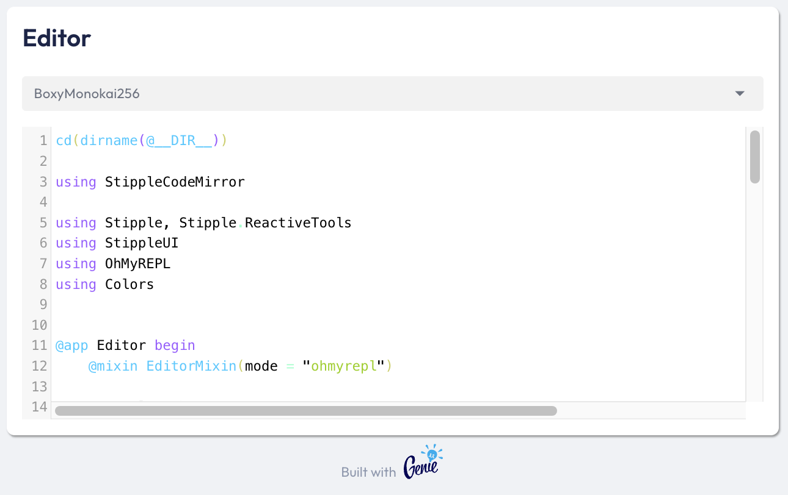

# StippleCodeMirror

Embedding CodeMirror instances in Stipple.

#### Exports

`codemirror()`:

* `mode`: the language for highlighting (out of the box support for Julia (CodeMirror and Ohmyrepl), Javascript and Python. In order to activate OhMyREPL coloring make sure you have loaded OhMyREPL and set the mode `mode = "ohmyrepl"`
* `background` (default: transparent): the background color as js color (e.g. `#fff0` or `#333`). If transparent, the background is determined by the style or class of the codemirror component
* `textcolor` (default: black)
* `options`: default: `OrderedDict(:lineNumbers = true)`: CodeMirror options
* `highlights`: Dictionary of css and tokens, calculated via `highlight(code)` for custom highlighting

`codemirror_deps()`, `external_codemirror_deps()`, `mode_deps()`, `external_mode_deps()`:

* dependencies to be added to the app, e.g. `@deps mode_deps`, see CodeMirrorDemo.jl

`highlight(code::Union{AbstractString, IO)`:

- `code` to be highlighted
- return value: highlights dictionary with css and tokens to be applied by CodeMirror, e.g. `highlights = highlight(code)`

`EditorMixin()`:

* Mixin to easily implement an editor into an app, see CodeMirrorDemo.jl

### CodeMirror Demo

```julia
using StippleCodeMirror

using Stipple, Stipple.ReactiveTools
using StippleUI
using OhMyREPL
using Colors


@app Editor begin
    @mixin EditorMixin(mode = "ohmyrepl")

    @in colorscheme = "GitHubLight"
    @in colorscheme_options = OhMyREPL.Passes.SyntaxHighlighter.SYNTAX_HIGHLIGHTER_SETTINGS.schemes |> keys

    @onchange isready begin
        code = read(@__FILE__, String)
    end
    @onchange mode notify(code)
    @onchange code on_code()
    @onchange colorscheme on_colorscheme()
end

@handler Editor function on_code()
    if mode == "ohmyrepl"
        highlights = StippleCodeMirror.highlight(code)
    end
end

@handler Editor function on_colorscheme()
    colorscheme!(colorscheme)
    notify(code)
    darkmode = contains(colorscheme, r"dark|night"i)
    textcolor = darkmode ? "#fff" : "#000"
    background = darkmode ? "#222" : "#fff"
end

@deps Editor local_codemirror_deps
@deps Editor local_mode_deps

ui() = row(cell(class = "st-module", [
    h3(class = "q-pb-lg", "Editor")

    Stipple.select(class = "q-pb-md", :colorscheme, "", options = :colorscheme_options, :standout, ref = "select")

    codemirror(class = "bg-red",
        :code,
        options = :options,
        mode = :mode,
        background = :background,
        textcolor = :textcolor,
        highlights = :highlights,
    )
]))

@page("/", ui, model = Editor, debounce = 0, throttle = 50)

up(open_browser = true)


```

#### Sample image



### Acknowledgement

A big thank you to the authors of [CodeMirror](https://codemirror.net/).

#### Note

Currently we stick to version 5 as there is no pre-built UMD distribution of version 6.
